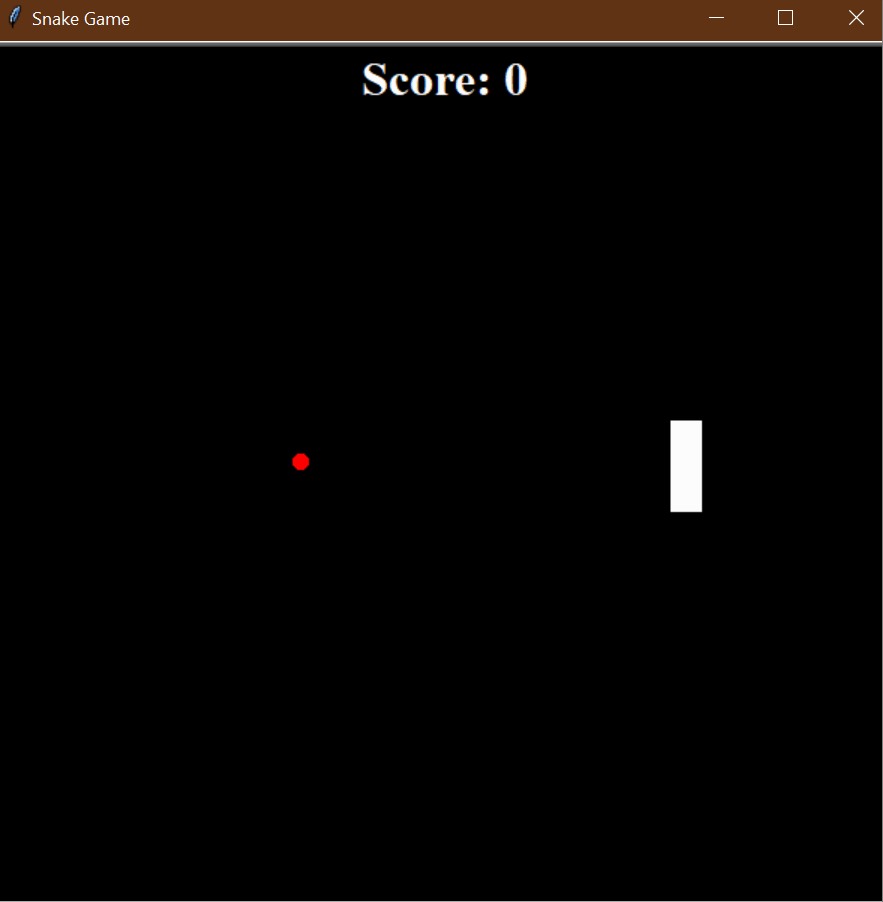

# 🐍 **Enhanced Snake Game** 🎮  

## Overview  
The **Enhanced Snake Game** is an improved version of the classic arcade game, where the snake moves across the screen, **eats food to grow**, and **tracks the score**. The game ends when the snake collides with the walls or itself. This version uses **Python's `turtle` module** and follows **Object-Oriented Programming (OOP)** principles.  

### 🌟 **Demo:**  
  

This project helps you:  
1. 🎮 **Learn game development basics** – movement, collision detection, and event handling.  
2. 🏗️ **Understand Object-Oriented Programming (OOP)** – modular code with `Snake`, `Food`, and `Scoreboard` classes.  
3. 🍏 **Implement growth mechanics** – make the snake **grow when it eats food**.  
4. 📊 **Track player progress** – with a **dynamic scoreboard**.  

## 🎯 **How It Works**  

### 1️⃣ **Start the Game** 🎬  
   - A **three-segment snake** appears on the screen.  
   - The game runs in a **loop**, updating the snake’s position **every 0.1 seconds**.  

### 2️⃣ **Control the Snake** ⬆️⬇️⬅️➡️  
   - Use the **arrow keys** to move the snake in different directions.  
   - The snake **cannot move in the opposite direction immediately**.  

### 3️⃣ **Eat Food & Grow** 🍏  
   - **A red food item** appears at a **random position** on the screen.  
   - If the **snake's head** reaches the food, the snake **grows by one segment**.  
   - The **score increases**, and new food spawns at a random location.  

### 4️⃣ **Score Tracking** 📊  
   - The **scoreboard** at the top of the screen updates every time the snake eats food.  

### 5️⃣ **Game Over Conditions** 💀  
   - The game **ends** if the snake **hits the wall**.  
   - The game **ends** if the snake **collides with its own body**.  
   - When the game is over, **"GAME OVER"** is displayed on the screen.  

## 📌 **How to Run**  

1. Open a terminal or command prompt. 💻  
2. Navigate to the folder containing the files. 📂  
3. Run the program using:  
   ```bash
   python main.py
   ```  
4. Control the snake using **arrow keys**, and play until you **hit the wall or yourself**!  

## 📝 **Example Gameplay**  

```plaintext
🐍 The snake moves across the screen.
🍏 Eats food and grows longer.
⬆️ Press Up to move up.
⬇️ Press Down to move down.
⬅️ Press Left to move left.
➡️ Press Right to move right.
💥 If you hit the wall or yourself, the game is over!
📊 Score is displayed at the top of the screen.
```

## 🏗️ **Project Structure**  

This project is structured using **modular OOP design**, making it easy to modify and expand:  

### `main.py`  
- **Handles game logic and updates the screen**  
- Listens for **user input** to control the snake  
- Detects **collisions with food, walls, and itself**  

### `snake.py`  
- **Defines the `Snake` class**  
- Handles **movement, direction changes, and growth**  

### `food.py`  
- **Defines the `Food` class**  
- Generates **random food locations** after being eaten  

### `scoreboard.py`  
- **Defines the `Scoreboard` class**  
- Displays and **updates the score**  
- Shows **"GAME OVER"** when the player loses  

### `images/snake.gif`  
- **Demonstration GIF**  
- Shows the **game in action!**  

## 📁 **Folder Structure**  

```
enhanced_snake_game/
├── main.py             # Main program logic
├── snake.py            # Snake movement and controls
├── food.py             # Food mechanics (random placement)
├── scoreboard.py       # Scoreboard display and updates
└── images/
    ├── snake.gif       # Demo GIF of the game
```

## 🚀 **Key Features**  

1. **🐍 Smooth Snake Movement** – The snake moves forward automatically.  
2. **🍏 Food Mechanics** – The snake eats **randomly placed food** and **grows**.  
3. **📊 Score Tracking** – The **score updates** when food is eaten.  
4. **💥 Collision Detection** – The game **ends if the snake hits a wall or itself**.  
5. **🐢 `Turtle` Graphics** – Uses Python’s **turtle module** for animation.  
6. **🔄 Continuous Game Loop** – Runs until the player **loses**.  

## 🌟 **Additional Notes**  

- 🔥 Try adding a **high score feature** that tracks the best performance!  
- 🎨 Modify `snake.py` to **change the snake's color** or **increase speed over time**.  
- 🚀 Expand the game by **adding levels or obstacles**!  

**🎉 Enjoy the Enhanced Snake Game! Can you get the highest score? 🐍🏆**  