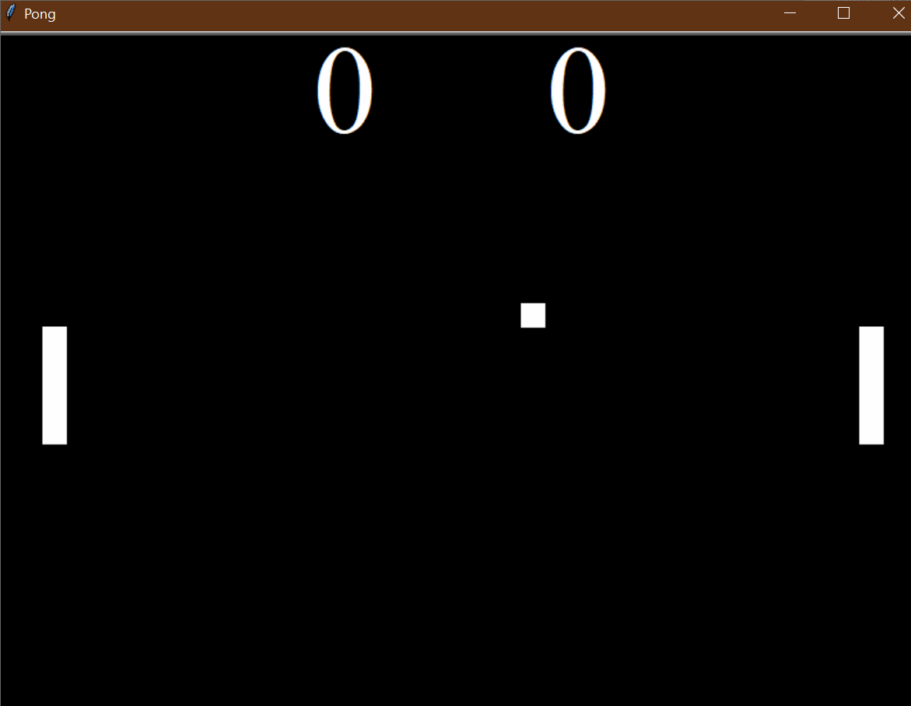

# 🏓 **Pong Game** 🎮  

## Overview  
The **Pong Game** is a **classic two-player arcade game** where players control paddles to hit a ball back and forth. The objective is to **prevent the ball from passing your paddle** while trying to make your opponent miss. This implementation is built using **Python’s `turtle` module** and follows **Object-Oriented Programming (OOP)** principles for modular design.  

### 🌟 **Demo:**  
  

This project helps you:  
1. 🎮 **Learn game mechanics** – movement, collision detection, and event handling.  
2. 🏗 **Understand Object-Oriented Programming (OOP)** – modular design with `Paddle`, `Ball`, and `Scoreboard` classes.  
3. 🏓 **Implement physics-based movement** – ball bouncing, paddle interaction, and increasing speed.  
4. 📊 **Track scores dynamically** – updates when a player scores a point.  

## 🎯 **How It Works**  

### 🏁 **Start the Game**  
- The game launches with **two paddles** and a **moving ball**.  
- Players **control the paddles** to keep the ball in play.  

### 🎮 **Controls**  
| Player | Move Up | Move Down |
|---------|---------|---------|
| **Left Paddle** | `W` | `S` |
| **Right Paddle** | `⬆️ Up Arrow` | `⬇️ Down Arrow` |

### ⚡ **Game Mechanics**  

1. **Ball Movement** 🏓  
   - The ball **moves in a diagonal direction** at the start.  
   - It **bounces off walls** and **paddles** dynamically.  

2. **Collision Handling** 🔄  
   - If the **ball hits the top or bottom wall**, it **bounces back**.  
   - If the **ball collides with a paddle**, it **reverses direction** and **speeds up**.  

3. **Scoring System** 📊  
   - If a player **misses the ball**, the opponent scores a point.  
   - The game **resets the ball** to the center after each score.  
   - The **score is displayed at the top of the screen**.  

## 📌 **How to Run**  

1. Open a terminal or command prompt. 💻  
2. Navigate to the folder containing the files. 📂  
3. Run the program using:  
   ```bash
   python main.py
   ```  
4. Use **W/S** or **Up/Down** keys to control the paddles.  
5. Play until one player wins or **challenge a friend!** 🏆  

## 📝 **Example Gameplay**  

```plaintext
🏓 The ball moves across the screen.
⬆️ Player 1 moves using "W" (up) and "S" (down).
⬇️ Player 2 moves using "Up Arrow" (up) and "Down Arrow" (down).
💥 If the ball collides with the paddle, it bounces back faster.
💀 If a player misses the ball, the opponent scores a point.
📊 The scoreboard updates dynamically.
```

## 🏗 **Project Structure**  

This project is structured using **Object-Oriented Programming (OOP)** for modularity and easy customization.  

### `main.py`  
- **Handles game logic** and updates the screen.  
- Listens for **player input to move paddles**.  
- Detects **collisions and scoring events**.  

### `paddle.py`  
- **Defines the `Paddle` class**.  
- Allows **up and down movement**.  

### `ball.py`  
- **Defines the `Ball` class**.  
- Moves, **bounces off walls**, and **collides with paddles**.  
- Increases speed with each hit.  

### `scoreboard.py`  
- **Tracks and updates scores**.  
- Displays the **score at the top of the screen**.  

### `images/pong.gif`  
- **Demonstration GIF**.  
- Shows **the game in action!**  

## 📁 **Folder Structure**  

```
pong_game/
├── main.py             # Main program logic
├── paddle.py           # Paddle movement controls
├── ball.py             # Ball physics and movement
├── scoreboard.py       # Score tracking and display
└── images/
    ├── pong.gif        # Demo GIF of the game
```

## 🚀 **Key Features**  

1. **🏓 Classic Pong Mechanics** – Players **hit the ball back and forth**.  
2. **🎮 Interactive Controls** – Two-player movement using **W/S & Arrow keys**.  
3. **💥 Collision Detection** – Ball **bounces off paddles and walls**.  
4. **📊 Dynamic Scoreboard** – Score **updates in real-time**.  
5. **🚀 Increasing Difficulty** – Ball **speeds up after each bounce**.  
6. **🐢 `Turtle` Graphics** – Uses Python’s **turtle module** for animation.  
7. **🔄 Continuous Game Loop** – The game runs **until a player wins**.  

## 🌟 **Additional Notes**  

- 🔥 Try adding a **winning score limit** (e.g., first to 5 wins).  
- 🎨 Modify `paddle.py` to **change paddle colors or sizes**.  
- 🚀 Expand the game by **adding sound effects** or **multiplayer controls**!  

**🎉 Enjoy playing Pong! Can you beat your opponent? 🏓🏆**  