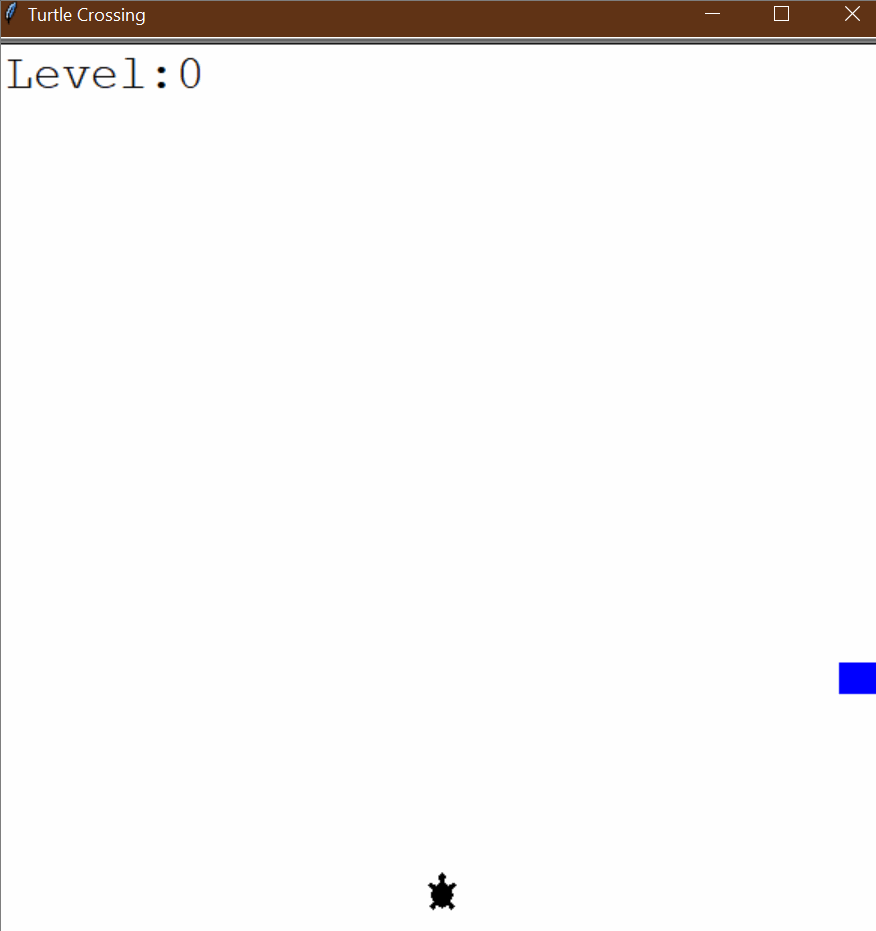

# 🐢 **Turtle Crossing Game** 🚗💨  

## Overview  
The **Turtle Crossing Game** is inspired by the classic **Frogger** arcade game, where the player controls a turtle trying to **cross a busy road** while avoiding moving cars. Each successful crossing **increases the level and speeds up the cars**, making it more challenging!  

### 🌟 **Demo:**  
  

This project helps you:  
1. 🎮 **Understand game loops and event handling** – smoothly animate objects and handle user input.  
2. 🏗 **Implement Object-Oriented Programming (OOP)** – modular design with `Player`, `CarManager`, and `Scoreboard` classes.  
3. 🚗 **Work with collision detection** – check when the turtle collides with moving cars.  
4. 📊 **Manage game difficulty dynamically** – increase speed as the player progresses.  

## 🎯 **How It Works**  

### 🏁 **Start the Game**  
- The game launches with a **turtle at the bottom of the screen** and cars moving across.  
- The player must **reach the top** without getting hit by a car.  

### 🎮 **Controls**  
| Action | Key |
|--------|-----|
| Move Up | `⬆️ Up Arrow` |

### ⚡ **Game Mechanics**  

1. **Turtle Movement** 🐢  
   - The turtle **only moves upwards** when the **Up Arrow** is pressed.  
   - The turtle **resets to the starting position** after reaching the top.  

2. **Car Traffic** 🚗  
   - Cars randomly **spawn from the right side** and move **toward the left**.  
   - The number of cars **increases over time**.  

3. **Collision Handling** 💥  
   - If the **turtle collides with a car**, the game **ends immediately**.  
   - The game displays **"GAME OVER"** when the player loses.  

4. **Level Progression** 📊  
   - Each time the turtle **crosses successfully**, the **score increases**.  
   - The game **speeds up** to make each level **more challenging**.  

## 📌 **How to Run**  

1. Open a terminal or command prompt. 💻  
2. Navigate to the folder containing the files. 📂  
3. Run the program using:  
   ```bash
   python main.py
   ```  
4. Use the **Up Arrow** to move the turtle upwards.  
5. Avoid cars and **reach the top** to progress through levels!  

## 📝 **Example Gameplay**  

```plaintext
🐢 The turtle starts at the bottom of the screen.
⬆️ Press Up to move towards the top.
🚗 Cars move from right to left across the road.
💥 If the turtle gets hit by a car, the game is over!
📊 If the turtle reaches the top, the level increases, and the game speeds up.
```

## 🏗 **Project Structure**  

This project is structured using **modular OOP design**, making it easy to modify and expand.  

### `main.py`  
- **Handles game logic and updates the screen**.  
- Listens for **user input to move the turtle**.  
- Detects **collisions and level progression**.  

### `player.py`  
- **Defines the `Player` class**.  
- Controls **movement and resets position**.  

### `car_manager.py`  
- **Manages car creation and movement**.  
- Increases **speed as levels progress**.  

### `scoreboard.py`  
- **Tracks and updates score levels**.  
- Displays **"GAME OVER"** when the player loses.  

### `images/turtle_crossing.gif`  
- **Demonstration GIF**.  
- Shows **the game in action!**  

## 📁 **Folder Structure**  

```
turtle_crossing_game/
├── main.py             # Main program logic
├── player.py           # Turtle movement and controls
├── car_manager.py      # Car spawning and movement
├── scoreboard.py       # Score tracking and level updates
└── images/
    ├── turtle_crossing.gif  # Demo GIF of the game
```

## 🚀 **Key Features**  

1. **🐢 Simple One-Key Gameplay** – Move using only the **Up Arrow**.  
2. **🚗 Dynamic Car Spawning** – Cars appear **randomly** to increase challenge.  
3. **📊 Level Progression** – The game gets **faster** as you progress.  
4. **💥 Collision Detection** – The game **ends if the turtle gets hit**.  
5. **🐢 `Turtle` Graphics** – Uses Python’s **turtle module** for animation.  
6. **🔄 Continuous Game Loop** – The game **runs until the player loses**.  

## 🌟 **Additional Notes**  

- 🔥 Try adding **left and right movement** for extra challenge!  
- 🎨 Modify `car_manager.py` to **change car colors or spawn rates**.  
- 🚀 Expand the game by **adding multiple lanes or obstacles**!  

**🎉 Enjoy the Turtle Crossing Game! How many levels can you reach? 🐢🚦**  