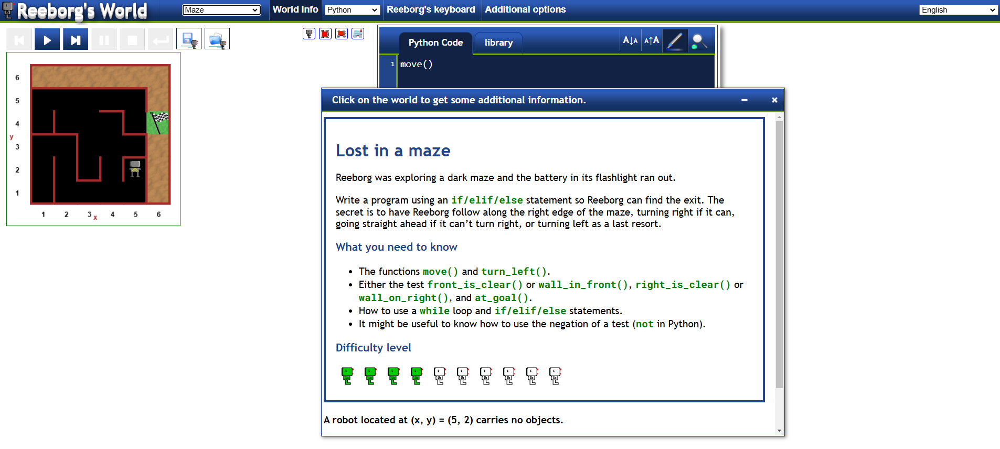
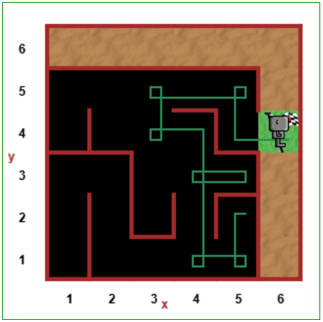

# 🧩 **Escape the Maze** 🏃‍♂️

## Overview  
**Escape the Maze** is an interactive Python project designed for the **Reeborg's World** platform. The goal is to navigate a robot through a maze using logical commands and Python code. With the right algorithm, the robot successfully reaches the finish line!

This project helps you:
1. 🤖 Practice Python programming with loops, conditions, and functions.  
2. 🛠️ Develop problem-solving and logical thinking skills.  
3. 🎮 Engage with a fun and interactive coding challenge!

## Problem Setup  

To begin, visit the official **Reeborg's World Maze challenge**:  
👉 [Reeborg's World Maze Challenge](https://reeborg.ca/reeborg.html?lang=en&mode=python&menu=worlds%2Fmenus%2Freeborg_intro_en.json&name=Maze&url=worlds%2Ftutorial_en%2Fmaze1.json)  

### Challenge Environment  
Here’s how the challenge appears in the Reeborg's World platform:



## Code Implementation  

To solve the maze, you can use the following Python script:  

```python
# Function to turn right
def turn_right():
    turn_left()
    turn_left()
    turn_left()

# Main navigation logic
while not at_goal():
    if right_is_clear():
        turn_right()
        move()
    elif front_is_clear():
        move()
    else:
        turn_left()
```

### Code Execution  
When the above code is executed, it guides the robot through the maze by:
- Checking if the right-hand path is clear.
- Moving forward when possible.
- Turning left if blocked on all sides.

Here’s what the solution looks like in the code editor:


## Final Outcome  

Once the code runs successfully, the robot reaches the finish line! 🎉 



## Key Features  

1. **📜 Custom Helper Function**:  
   - Includes a `turn_right()` function for simplicity.  

2. **🤖 Smart Navigation**:  
   - Uses `if/elif/else` conditions to handle different scenarios.  

3. **🔄 Looping Until Goal**:  
   - Ensures the robot keeps moving until it reaches the goal.  

4. **🧩 Problem-Solving Practice**:  
   - Great for improving logical thinking and coding skills.  

## Additional Notes  

- 🧠 Experiment with different maze layouts to test your algorithm.  
- 🏆 Customise the logic to add new features or optimise the robot’s path.  
- 🌟 A fantastic project for beginners and intermediate Python learners!  

**🚀 Have fun escaping the maze with Reeborg!** 🎉 
